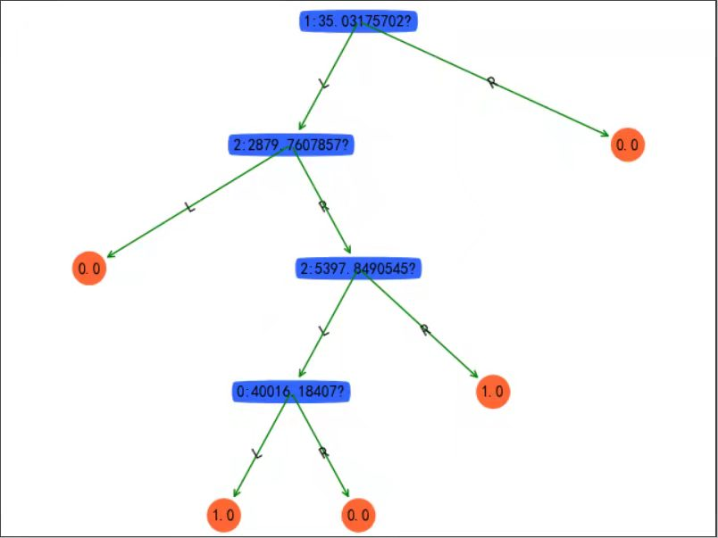
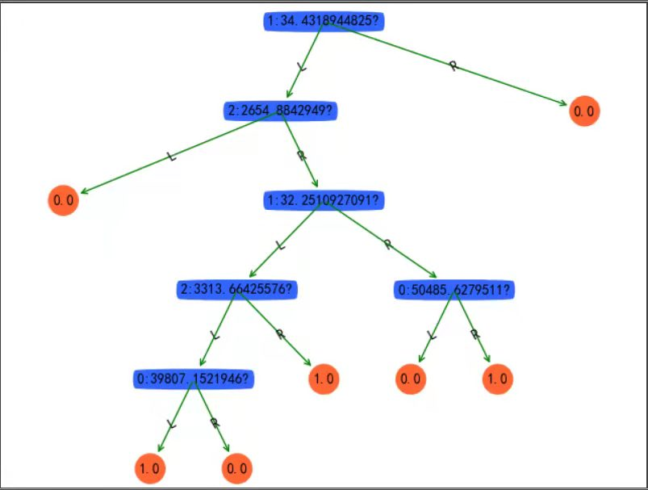
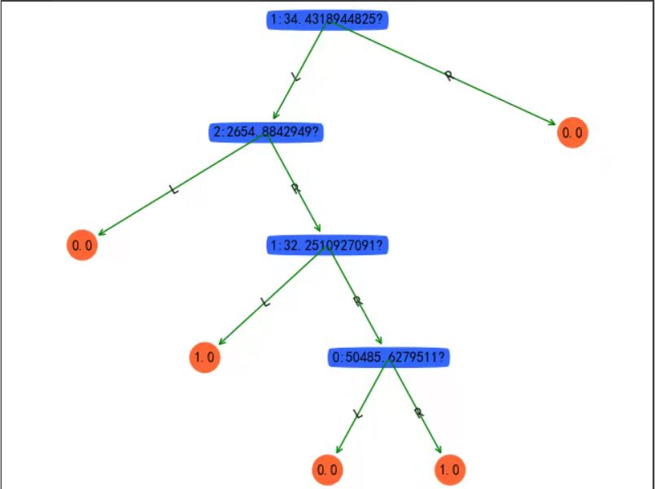
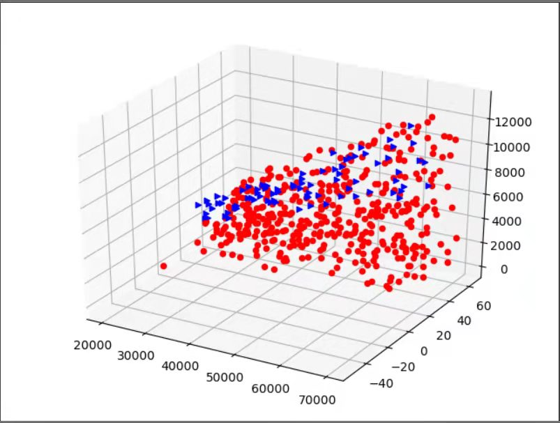
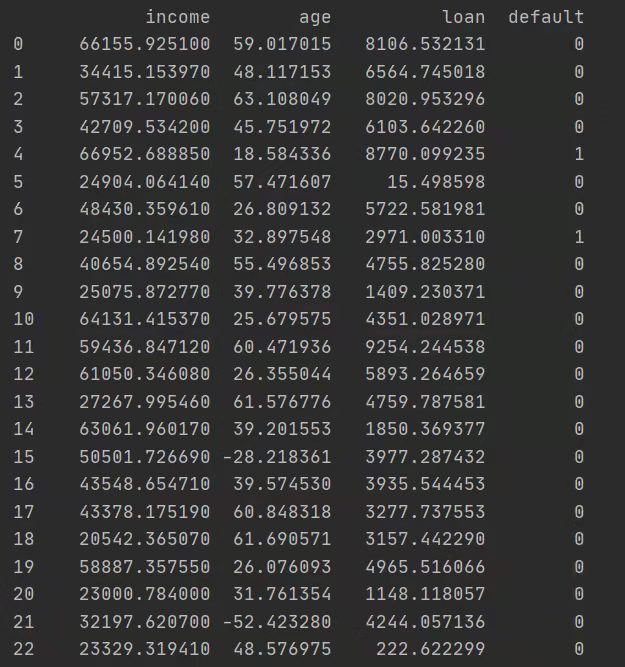

# Credit load predict
The question about if the loader will default or not .

***
```
dependence:
numpy
pandas
matplotlib
```
***
```
#Modify according to your own path
filepath = './Mydata/Credit.xlsx'
```
- **Tree**:
Based on decision tree to predict the result.

- **treePlotter**:
Presentation of the final result

- The data of Credit Card Default in this project is something the credit depending on the three features including age
load income. And based on these features to predict if he will default the banks.

- 
- 
- 
- 
- 

- Student majored in artificial intelligence from XDU
- [Personal Blog](https://blog.csdn.net/qq_49392169)
- QQ: 2539110495